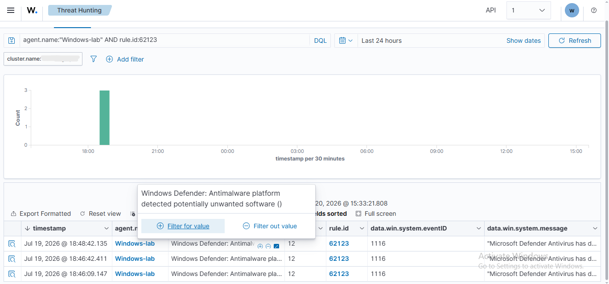
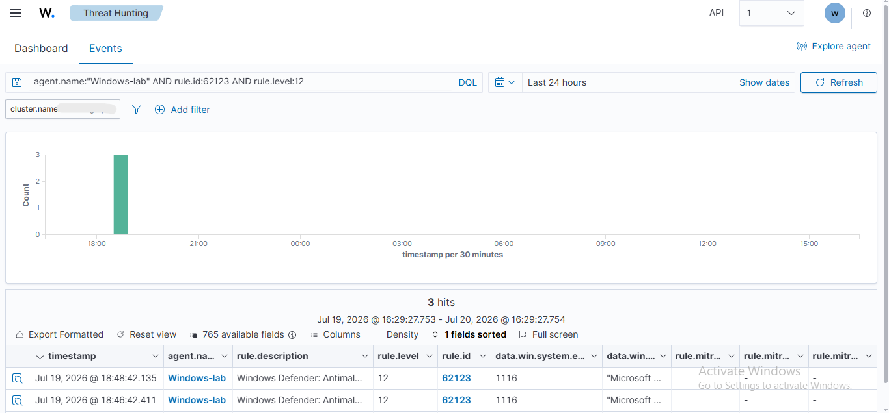
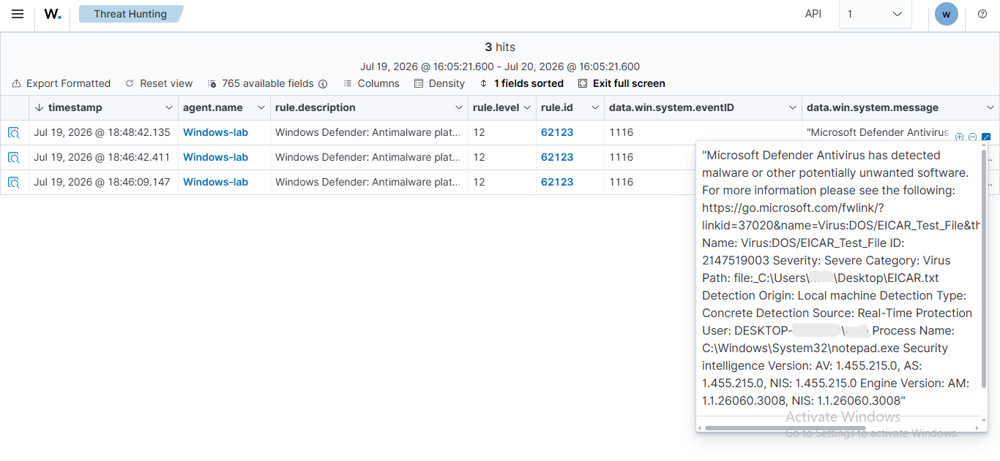
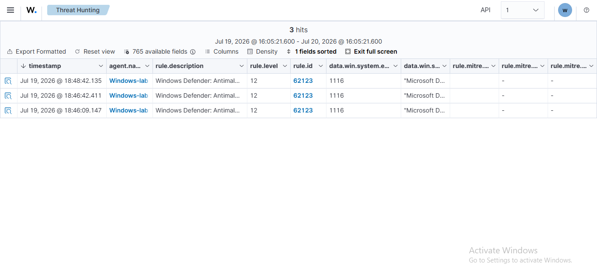

# Threat Hunting with Wazuh

## Overview

This task focused on using Wazuh Threat Hunting to filter, review, and investigate high-severity Microsoft Defender alerts.

The alerts were generated during the controlled EICAR antivirus test performed on the Windows endpoint.

## What I Did

- Opened the Threat Hunting module in Wazuh.
- Filtered events using the Windows agent name.
- Filtered the results using Wazuh Rule ID `62123`.
- Added severity level `12` to narrow the search.
- Reviewed the matching Windows Defender Event ID `1116` alerts.
- Opened an individual alert and examined its full Windows Defender message.
- Checked the available MITRE ATT&CK fields for the selected rule.

## Investigation Result

Three matching high-severity Defender alerts were identified.

The alert details confirmed that the activity was related to the controlled EICAR test file rather than an uncontrolled malware infection.

The reviewed event contained:

- **Rule ID:** 62123
- **Windows Event ID:** 1116
- **Agent:** Windows-lab
- **Wazuh Severity:** Level 12
- **Defender Severity:** Severe

No MITRE ATT&CK technique was mapped to Wazuh Rule ID `62123`.

## Screenshots

### Filter by agent and rule ID

### Severity level 12 results

### Defender alert investigation

### MITRE ATT&CK fields

## Skills Practiced

- Threat hunting
- SIEM event filtering
- High-severity alert investigation
- Windows Defender event analysis
- Rule and event ID validation
- MITRE ATT&CK field review
