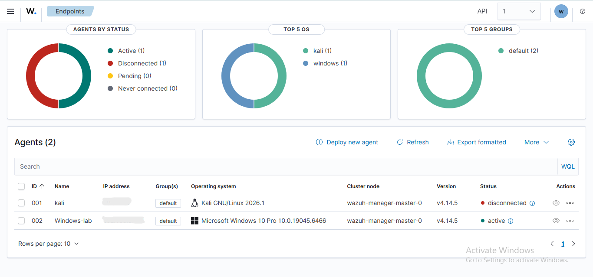
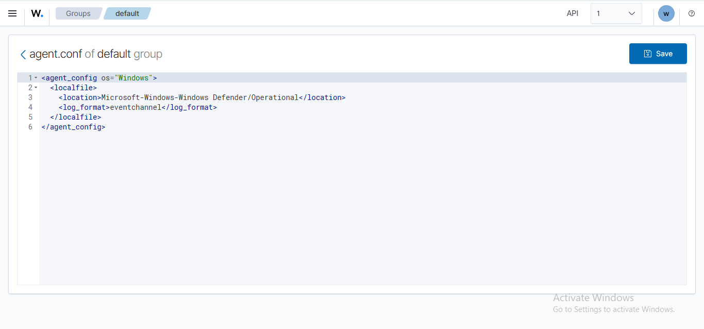
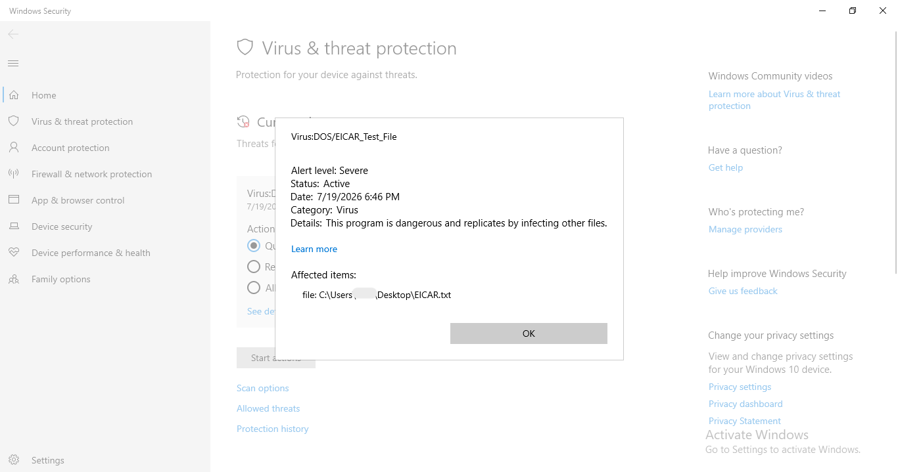
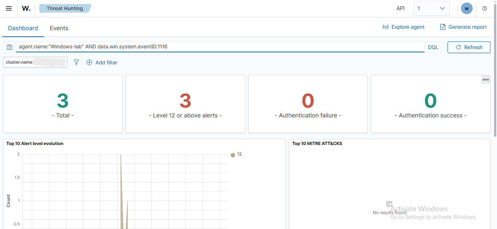
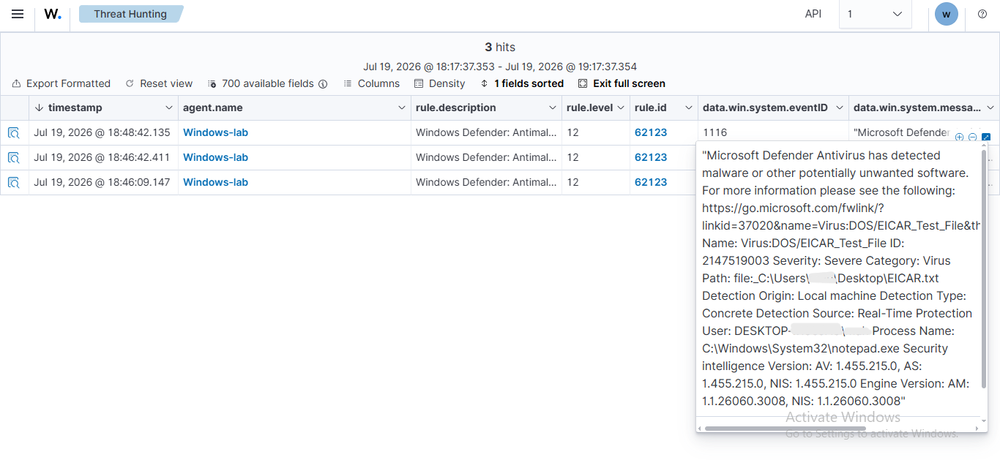

# Windows Defender Integration with Wazuh

## Overview

This task was completed as part of my ongoing cybersecurity traineeship. I connected a Windows 10 endpoint to Wazuh and configured the agent to collect Microsoft Defender operational events.

The integration was tested using the standard EICAR antivirus test file. EICAR is a harmless test file designed to check whether antivirus and security monitoring tools are working correctly.

## What I Did

- Deployed the Wazuh agent on a Windows 10 endpoint.
- Confirmed that the Windows agent was active and connected.
- Configured the Wazuh agent to collect events from:

```text
Microsoft-Windows-Windows Defender/Operational
```

- Created the standard EICAR test file on the Windows endpoint.
- Confirmed that Microsoft Defender detected the file as a severe threat.
- Filtered the generated events in Wazuh using Windows Defender Event ID 1116.
- Reviewed the alert details, including the threat name, affected path, severity, detection source, and timestamp.

## Result
Microsoft Defender detected the EICAR test file through real-time protection. Wazuh successfully collected the Defender event through the Windows agent.

The generated alert was recorded under:

- **Event ID:** 1116
- **Wazuh Rule ID:** 62123
- **Wazuh Alert Level:** 12
- **Threat Name:** Virus:DOS/EICAR_Test_File

This confirmed that Microsoft Defender alerts were being collected and displayed correctly in Wazuh.

## Screenshots

### Windows agent active



### Defender event channel configuration



### Microsoft Defender EICAR detection



### Defender alerts collected in Wazuh



### Defender alert details



## Skills Practiced
- Wazuh agent deployment
- Windows event-channel collection
- Microsoft Defender monitoring
- SIEM alert analysis
- Endpoint threat detection
- Event filtering and validation
